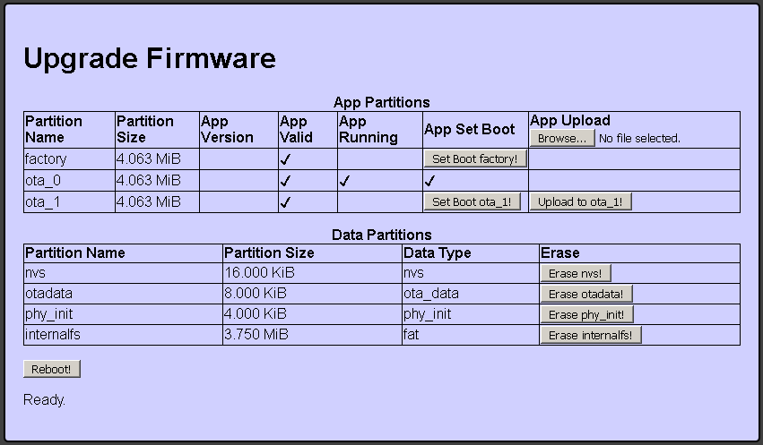

This is an example of how to use [libesphttpd](https://github.com/chmorgan/libesphttpd) with the Espressif FreeRTOS SDK [ESP-IDF](https://github.com/espressif/esp-idf).

# Example Features


## WiFi Provisioning GUI

## OTA Firmware Update GUI

## File Upload/Download GUI


# ESP32

Set-up your build environment by following the [instructions](https://docs.espressif.com/projects/esp-idf/en/latest/get-started/index.html)

After cloning this repository, ensure that you have updated submodules appropriately:

```git submodule update --init --recursive```

Run the esp32 makefile (make sure you enable the esphttpd component) and build

```make```

Load onto your esp32 and monitor

```make flash monitor```

If you wish to use CMake, you should make sure you have cmake and ninja-build installed.  While not necessary, ninja-build speeds up the build process a lot.  The build and loading steps are similar:

`idf.py build` and `idf.py flash monitor`

## Tips
Make sure the ```ESP_IDF``` environment variable is set.   
``` export IDF_PATH=/home/user/esp-idf ``` (replace the path as appropriate)

To speed-up the build process, include the ```-j``` option to build on multiple CPU threads.  i.e.  
```make -j8 flash monitor```

To avoid having to run menuconfig to change your serial port, try setting the variable ```ESPPORT```.  
You can usually acheive a very fast baud rate to upload to the ESP32.  This will set the baud to nearly 1M.  
```make -j8 flash monitor ESPPORT=COM21 ESPBAUD=921600```

# ESP8266

Building for ESP8266 requires a bit more work.

Ensure that you are defining SDK_PATH to point at the ESP8266_RTOS_SDK:

```export SDK_PATH=/some/path/ESP8266_RTOS_SDK```

Update your path to point at your xtensa-lx106 tool chain, something like:

```export PATH=/some/path/esp-open-sdk/xtensa-lx106-elf/bin:$PATH```

If you don't have these tools you can get the SDK from:
https://github.com/espressif/ESP8266_RTOS_SDK

And you can get the crosstool source (you'll have to build the toolchain yourself) from :
https://github.com/pfalcon/esp-open-sdk

And then you should be able to build with:

```make -f Makefile.esp8266 USE_OPENSDK=yes FREERTOS=yes -C libesphttpd```

# Old notes

(I'm not sure these still apply, I mostly build for ESP32, feedback and pull requests welcome in this area)

The Makefile in this example isn't perfect yet: something is going wrong with the dependency
checking, causing files that have changed not always being recompiled. To work around this,
please run a
```make clean && make -C libesphttpd && make```
before running
```make flash```
