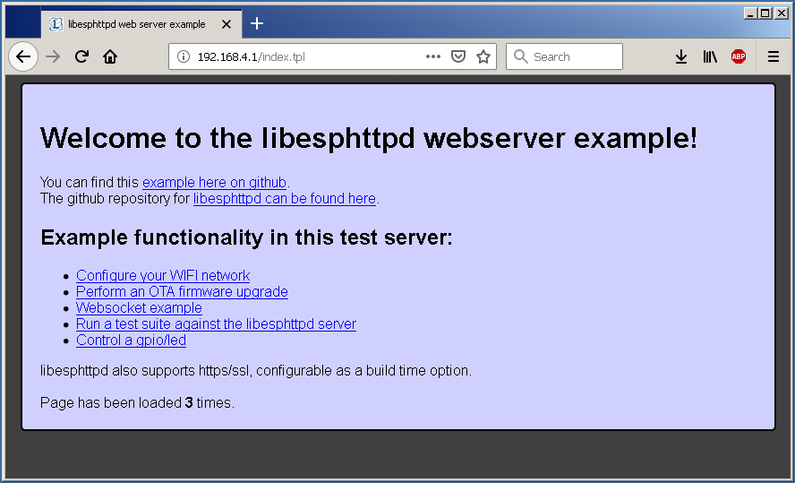
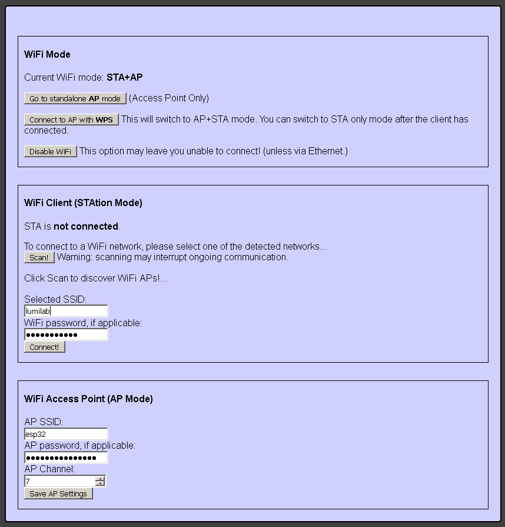
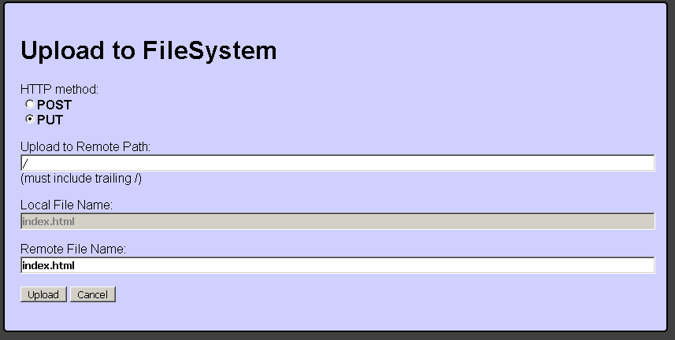

This is an example of how to use [libesphttpd](https://github.com/chmorgan/libesphttpd) with the Espressif FreeRTOS SDK [ESP-IDF](https://github.com/espressif/esp-idf).

# Example Features


## WiFi Provisioning GUI

## OTA Firmware Update GUI

## File Upload/Download GUI


# ESP32 (ESP-IDF)

Set-up your build environment by following the [instructions](https://docs.espressif.com/projects/esp-idf/en/latest/get-started/index.html)

After cloning this repository, ensure that you have updated submodules appropriately:

```git submodule update --init --recursive```

## CMAKE Build
If you wish to use CMake, you should make sure you have cmake and ninja-build installed.  While not necessary, ninja-build speeds up the build process a lot.  The build and loading steps are similar:

`idf.py build` and `idf.py flash monitor`

## Legacy Makefile Build

### Windows
 - install node.js, choose to put it in the path
 - edit c:\msys32\msys2_shell.cmd and add:
```
set MSYS2_PATH_TYPE=inherit
set MSYSTEM=MINGW32
```
 - Run c:\msys32\msys2_shell.cmd

Run the esp32 makefile (make sure you enable the esphttpd component) and build

```make```

Load onto your esp32 and monitor

```make flash monitor```

### Tips
Make sure the ```ESP_IDF``` environment variable is set.   
``` export IDF_PATH=/home/user/esp-idf ``` (replace the path as appropriate)

To speed-up the build process, include the ```-j``` option to build on multiple CPU threads.  i.e.  
```make -j8 flash monitor```

To avoid having to run menuconfig to change your serial port, try setting the variable ```ESPPORT```.  
You can usually acheive a very fast baud rate to upload to the ESP32.  This will set the baud to nearly 1M.  
```make -j8 flash monitor ESPPORT=COM21 ESPBAUD=921600```

# ESP8266

&#x1F53A; Warning: The build is currently broken for ESP8266.  This fork does not currently support ESP8266 since we don't have a maintainer who is using that chip.
